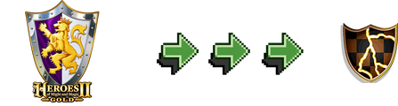

# homm2-to-fheroes2

[](LICENSE)
[](https://github.com/slavamokerov/homm2-to-fheroes2/actions/workflows/ci.yml)



A converter of **Heroes of Might and Magic II** save files to the
[fheroes2](https://github.com/ihhub/fheroes2) save format.

It reads saves made by the original game (`.GM1` for standard games,
`.GMC` for The Succession Wars campaigns, `.GXC` for The Price of Loyalty
campaigns) and writes fheroes2 saves (`.sav` / `.savc`, format version
10033 by default; 10032 and 10034 are also selectable) that can be
loaded and played in fheroes2.

## Contents

- [Try it online](#try-it-online)
- [Command line](#command-line)
- [What gets converted and what may differ](#what-gets-converted-and-what-may-differ)
- [Building from source](#building-from-source)
- [Architecture](#architecture)
- [Tests](#tests)
- [FAQ](#faq)
- [Credits](#credits)
- [License](#license)

## Try it online

**[homm2-to-fheroes2 web converter](https://slavamokerov.github.io/homm2-to-fheroes2/)**

Select one or several `.GM1` / `.GMC` / `.GXC` files — they are converted
right on the page, and you download the resulting `.sav` / `.savc` files
one by one or all together as a zip archive. The files never leave your
computer.

## Command line

The same converter as a CLI:

```bash
homm2-to-fheroes2 [--format 10032|10033|10034] <input.GM1|GMC|GXC> [output.sav|savc] [more inputs…]
```

If the output name is omitted, the input name is used with the new
extension (`.GM1` → `.sav`, `.GMC` → `.savc`, `.GXC` → `.savc`).

## What gets converted and what may differ

The converter translates:

- map size, name, description, difficulty, victory/loss conditions;
- the in-game date (day/week/month);
- all heroes — position, experience, primary and secondary skills, spell
  book, artifacts, army (5 slots), name, portrait, owner;
- kingdoms — the 7 resources, castle and hero lists;
- castles — owner, garrison, built structures, Mage Guild;
- the map — terrain, roads, objects and overlays, fog of war, mines,
  boats, obelisks;
- campaign progress (`.GMC` / `.GXC` → `.savc`).

What is **not** carried over or is simplified:

- the original cheat flag (fheroes2 has no equivalent);
- high scores (start empty);
- multiplayer/hot-seat saves (not supported);
- hero movement paths and the note of what each hero has already visited:
  a hero on a planned route stands still (movement is recalculated the
  next day), and some once-per-hero bonuses (e.g. Faerie Ring) may
  trigger again;
- AI-only fields (set to defaults);
- rumors, adventure map events, sign and sphinx texts (fheroes2 stores
  them in a section the converter does not populate);
- barrier passwords (fheroes2 generates its own; the barrier colors are
  kept);
- map objects without an fheroes2 counterpart (converted to the closest
  equivalent or plain terrain);
- campaign bonuses specific to the original game.

The full mapping and the reasoning are in
[`docs/CONVERSION.md`](docs/CONVERSION.md); the source save format is
documented in [`docs/HOMM2_SAVE_FORMAT.md`](docs/HOMM2_SAVE_FORMAT.md).

A converted save can no longer be loaded by the original game: it is
written in fheroes2's save format.

## Building from source

Native CLI:

```bash
cmake -S . -B build -DCMAKE_BUILD_TYPE=Release
cmake --build build
```

Dependencies: CMake ≥ 3.16, a C++17 compiler, zlib.

The web version requires the [Emscripten SDK](https://github.com/emscripten-core/emscripten)
(`emcc`/`em++` on `PATH`):

```bash
./web/build.sh        # output in web/deploy/
```

## Architecture

- `src/homm2_save.*` — parser for `.GM1` / `.GMC` / `.GXC` (all three
  layout variants).
- `src/fheroes2_save.*` — writer for the fheroes2 save format (versions
  10032–10034, big-endian, zlib-compressed stream).
- `src/convert.*` — the conversion itself and the ID mapping tables.
- `src/main.cpp` — the CLI.
- `web/` — the browser version: the same core compiled to WebAssembly
  (Emscripten/embind) with a plain JavaScript UI. `web/build.sh` builds
  it; `web/deploy/` is the resulting static site (git-ignored).
- `tools/analyze.py` — a developer tool that prints a summary of a save
  file (the reference parser for the format documentation).
- `tools/extract_assets.py` — extracts resources (e.g. the CLOF32.TIL
  fog tiles) from the original `HEROES2.AGG`.
- `tests/fixtures/` — original-game saves used by the test suite.

The converter is self-contained: it does not use Qt, does not depend on
the fheroes2 sources and does not require any game data files.

## Tests

```bash
cmake --build build && ctest --test-dir build
```

The test suite parses every fixture save, converts it (in all three
format versions) and checks the structure of the result: header, format
version, end-of-stream marker, heroes, armies, resources. It also
compares the converted Slugfest map tile-by-tile against a reference
save made by fheroes2 itself.

## FAQ

**Will fheroes2 accept the converted save?** The output targets the
fheroes2 save format versions 10032–10034 (10033 by default, read by
fheroes2 1.1.15 and later):
- 10032 — fheroes2 1.1.11+
- 10033 — fheroes2 1.1.15+ (default, widest compatibility)
- 10034 — fheroes2 1.1.80+

Pick a version in the [web version](https://slavamokerov.github.io/homm2-to-fheroes2/)
or on the CLI with `--format`:

```bash
homm2-to-fheroes2 --format 10034 save.GM1 save.sav
```

**Can I convert back?** No. Conversion is one-way: original → fheroes2.

**Can I convert an edited fheroes2 save?** No. The input must be a save
written by the original Heroes of Might and Magic II. If you want to
edit an fheroes2 save file instead, use
[fheroes2-save-editor](https://github.com/slavamokerov/fheroes2-save-editor).

**Why does my hero have no movement path after conversion?** Paths are
cleared by design; fheroes2 recalculates movement on the next day.

**Something's broken or you have an idea?** Open an
[issue on GitHub](https://github.com/slavamokerov/homm2-to-fheroes2/issues).

## Credits

The original save format was recovered thanks to the
[project-ironfist](https://github.com/jkoppel/project-ironfist)
decompilation; their reverse-engineering work is the foundation of
[`docs/HOMM2_SAVE_FORMAT.md`](docs/HOMM2_SAVE_FORMAT.md). The findings
were verified byte-for-byte against saves made with the original game.

The fheroes2 save format is documented in the
[fheroes2-save-editor](https://github.com/slavamokerov/fheroes2-save-editor)
project. The web page design is modeled after the
[fheroes2](https://ihhub.github.io/fheroes2/) website.

Heroes of Might and Magic II is © Ubisoft. This project does not
distribute any game files.

## License

[GPL-2.0](LICENSE)
